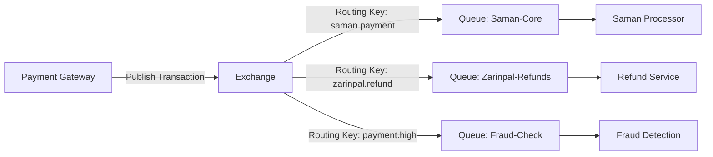

در معماری پیام‌رسانی با RabbitMQ (به‌خصوص در سیستم‌های مالی و پرداخت)، **Exchange** و **Queue** دو مفهوم مکمل اما متمایز هستند. درک تفاوت آن‌ها برای طراحی سیستم‌های قابل اعتماد و مقیاس‌پذیر حیاتی است.

---

### **تفاوت Exchange و Queue در یک نگاه**
| **مؤلفه**   | **Exchange (مبادله)**                  | **Queue (صف)**                     |
|-------------|----------------------------------------|------------------------------------|
| **نقش**     | **مسیریاب پیام**                       | **مخزن ذخیره‌سازی پیام**           |
| **مسئولیت** | دریافت پیام از Producer و ارسال به صف(ها) بر اساس قوانین (Binding) | نگهداری پیام تا زمانی که Consumer آن را پردازش کند |
| **مکانیسم** | تعیین می‌کند پیام به **کدام صف(ها)** برود | پیام‌ها را تا پردازش **ذخیره** می‌کند |
| **تعداد**   | یک پیام می‌تواند به **چندین صف** ارسال شود | هر صف فقط به **یک Consumer** تحویل می‌دهد (مگر حالت Competing Consumers) |

---

### **زمان استفاده از هرکدام (با مثال دنیای پرداخت)**
#### ۱. **Exchange: چه زمانی استفاده می‌شود؟**
- **نیاز به مسیریابی هوشمند**: هنگامی که پیام باید بر اساس **نوع تراکنش**، **درگاه پرداخت**، یا **پلتفرم مقصد** به صف‌های مختلف هدایت شود.
- **مثال واقعی**:  
  یک **سوئیچ پرداخت** پیام تراکنش را دریافت می‌کند. Exchange آن را بر اساس `درگاه مقصد` (مثلاً `zarinpal`، `saman`) به صف مربوطه ارسال می‌کند.

#### ۲. **Queue: چه زمانی استفاده می‌شود؟**
- **نیاز به ذخیره‌سازی و پردازش ترتیبی**: وقتی پیام‌ها باید **پشت سر هم پردازش** شوند (مثلاً تراکنش‌های مالی که حساس به ترتیب هستند).
- **مثال واقعی**:  
  صف `saman-payments` تمام تراکنش‌های درگاه سامان را **ذخیره** می‌کند تا سرویس پردازشگر (Consumer) آن‌ها را یکی‌یکی پردازش کند.

#### ۳. **استفاده همزمان: چرا و چگونه؟**
- **الزامی است!** در RabbitMQ **همیشه** پیام از Producer → Exchange → (از طریق Binding) → Queue → Consumer جریان دارد.
- **مثال**:
    - تراکنش پرداخت با `amount > 10,000,000 تومان` باید همزمان به **دو صف** ارسال شود:
        - صف `high-risk-payments` (برای بازرسی تقلب)
        - صف `saman-core` (برای پردازش اصلی)
    - این کار با **Topic Exchange** و Binding کلید `payment.high.#` انجام می‌شود.

---

### **معماری نمونه: سوئیچ پرداخت با RabbitMQ**

#### **اجزای معماری:**
۱. **Exchange (از نوع Topic)**:
- قوانین مسیریابی:
    - `saman.*` → صف `Saman-Core`
    - `*.refund` → صف `Refund-Processor`
    - `payment.high` → صف `Fraud-Check`

۲. **Queue ها**:
- `Saman-Core`: پردازش اصلی تراکنش‌های سامان.
- `Zarinpal-Refunds`: مدیریت برگشت‌های زرین‌پال.
- `Fraud-Check`: بررسی تراکنش‌های پرریسک (موازی با پردازش اصلی).

۳. **سرویس‌ها (Consumer ها)**:
- هر سرویس **مستقل** فقط به صف خود متصل است (اگر سرویس Fraud-Check داون شود، تراکنش‌ها در صف می‌مانند).

---

### **الگوهای Exchange در پرداخت**
- **Direct Exchange**:
    - مسیریابی بر اساس **دقیقاً یک کلید** (مثل `saman.payment`).
    - استفاده: ارسال تراکنش به **یک درگاه خاص**.

- **Topic Exchange**:
    - مسیریابی **پترن‌بندی** (مثل `payment.#.high`).
    - استفاده: ارسال تراکنش‌های **بالای ۱۰ میلیون** به صف بازرسی.

- **Fanout Exchange**:
    - ارسال پیام به **همه صف‌های متصل**.
    - استفاده: ارسال **لاگ تراکنش** به صف‌های `Audit-Log`، `Analytics`، `Backup`.

- **Headers Exchange**:
    - مسیریابی بر اساس **هدر پیام** (نه کلید).
    - استفاده کمیاب (معمولاً در پرداخت کاربرد ندارد).

---

### **چرا این معماری برای پرداخت مناسب است؟**
۱. **تقسیم بار (Load Balancing)**:
- چندین Consumer برای یک صف (مثلاً ۳ نمونه `Saman-Processor` روی صف `Saman-Core`).

۲. **تحمل خطا (Fault Tolerance)**:
- اگر سرویس پردازشگر سامان داون شود، پیام‌ها در صف باقی می‌مانند.

۳. **انعطاف‌پذیری**:
- افزودن سرویس جدید (مثلاً `Currency-Converter`) بدون تأثیر روی Producer.

۴. **مدیریت ترافیک**:
- تنظیم **TTL (زمان انقضا)** برای پیام‌ها (مثلاً تراکنش‌های پرداخت نشده پس از ۳۰ دقیقه حذف شوند).

۵. **پیچیدگی‌های پرداخت**:
- پیام‌های ناموفق به **صف مرده (Dead Letter Queue)** منتقل می‌شوند تا بعداً بررسی شوند.

---

### **جمع‌بندی: کی از چه چیزی استفاده کنیم؟**
- **فقط Exchange**: غیرممکن! حتماً باید به صف متصل شود.
- **فقط Queue**: فقط اگر **یک Producer و یک Consumer** دارید (کاربرد محدود).
- **ترکیب Exchange + Queue**:
    - نیاز به **مسیریابی هوشمند** دارید (مثلاً در سوئیچ پرداخت).
    - نیاز به **پردازش موازی** دارید (مثلاً بازرسی تقلب + پردازش اصلی).
    - نیاز به **برودکست** دارید (مثلاً اطلاع‌رسانی به چند سرویس).

در سیستم‌های مالی، **ترکیب Topic Exchange + Durable Queues + Dead Letter Handling** معمولاً بهترین انتخاب است!

